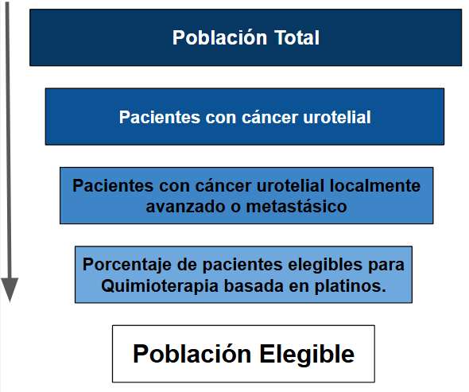

## Avelumab como mantenimiento para Cancer urotelial localmente avanzado o Metastásico

Esta herramienta es un visualizador interactivo desarrollado en Shiny que integra el modelo de impacto presupuestario adaptado por el equipo de investigación del IECS para Avelumab como tratamiento de mantenimiento en el Cancer Urotelial localmente avanzado o metastásico para Argentina.
El modelo estima la diferencia entre los costos asociados al uso de recursos en dos escenarios: el escenario actual, que refleja la distribución de tratamientos vigente, y un escenario proyectado o alternativo, en el que se plantea un incremento progresivo en la utilización de la intervención de interés.
El modelo sigue a una cohorte de personas durante 1 a 5 años. A partir de una población determinada, estima el número de personas a los que se le diagnosticara cancer urotelial en un estadio avanzado o llegaran al mismo por año.

{.img-modelo}

Una vez identificada la población elegible, el modelo estima cuántas personas recibirían cada alternativa terapeutica (Quimioterapia basada en platinos seguido o no de Avelumab, quimioterapia basada en cisplatino asociada a Nivolumab o  Enfortumab Vedotin Pembrolizumab). Las personas recibiran una u otra tecnología según las tasas de participación en el mercado asignadas a cada vacuna y grupo etario, dependiendo del escenario

A partir de allí, el modelo calcula los costos de adquisición y administración de las drogas de primera linea, de sus efectos adversos, manejo de la enfermedad y monitoreo del tratamiento, los costos asociados al monitoreo, adquisición y administración de los tratamientos subsecuentes que recibe el paciente una vez alcanzada la progresión de la enfermedad.

El resultado final del modelo es la diferencia total de costos entre ambos escenarios, lo que determina el impacto presupuestario para el financiador. Este impacto puede expresarse en términos absolutos, como porcentaje relativo al presupuesto del escenario actual, o como impacto presupuestario por miembro por mes (PMPM), que representa cuánto dinero adicional por persona por mes se requeriría para financiar la tecnología de interés.

El visualizador permite obtener los resultados del modelo de Impacto Presupuestario modificando ciertos parámetros los cuales están divididos en básicos, encontrandose en la misma pantalla de resultados, y avanzados los cuales se encuentran en la sección de configuración; esta división se basa unicamente en la frecuencia esperada de modificación de los mismos.